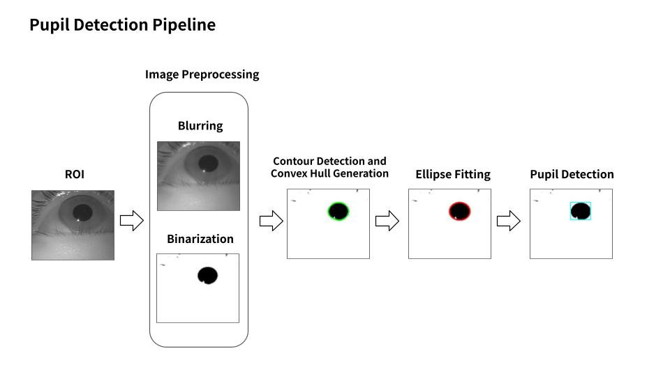
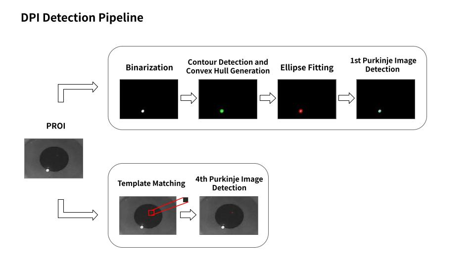
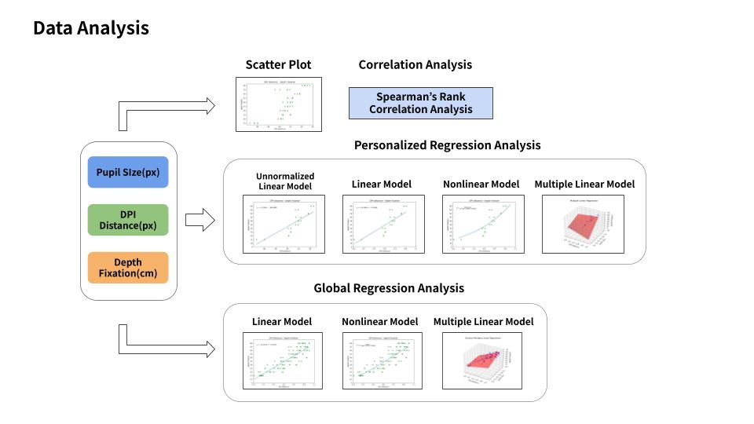

# A Study on Correlation of Depth Fixation with Distance Between Dual Purkinje Images and Pupil Size

📄 **Paper**: Electronics, 2025  
🔗 https://doi.org/10.3390/electronics14091799  

---

## Overview

This project investigates a **monocular gaze depth estimation method** based on:

- **Distance between Dual Purkinje Images (DPI)**
- **Pupil size**

The goal is to develop a **low-cost, single-camera, single-eye-image-based approach** that overcomes the limitations of conventional gaze depth estimation systems.

---

## Project Structure

```bash
.
├── ImageProcessing/
│   ├── code/
│   │   ├── include/
│   │   ├── src/
│   │   │   ├── experiment_run.cpp
│   │   │   ├── image_processing.cpp
│   │   │   └── pupil_detector.cpp
│   │   └── main.py
│   ├── data/
│   └── results/
│
├── ResultAnalysis/
│   ├── code/
│   │   └── src/
│   │       ├── data_loader.py
│   │       ├── linear_analysis.py
│   │       ├── logistic_curve_analysis.py
│   │       ├── plot_utils.py
│   │       └── stat_analysis.py
│   │   └── main.py
│   ├── data/
│   └── results/
```

---

## Background

With the growing demand for **3D gaze tracking** in applications such as AR/VR, HCI, and robotics, **gaze depth estimation** has become an increasingly important research topic.

However, existing methods typically have the following limitations:

- Dependence on binocular systems
- Multiple-camera setups
- High implementation costs

To address these challenges, this study proposes a gaze depth estimation framework that satisfies:

- Single-eye operation
- Single-camera setup
- Low computational complexity and cost

---

## Contributions

1. Propose a **monocular gaze depth estimation method** using **DPI distance and pupil size**.
2. Conduct experiments over a **wide gaze depth range (15–60 cm)** at **5 cm intervals**.
3. Demonstrate the feasibility of a **low-cost approach**.

---

## Dataset

- **Total participants**: `11` 
- **Subjects included in analysis**: `8`  

### Gaze Depth Setup

- Range: `15 cm – 60 cm` 
- Interval: `5 cm`
- Total depth levels: `10`

### Data Acquisition

- `~7 seconds` of right-eye video per depth level
- `5 frames` extracted per depth
  - `3` for training  
  - `2` for testing  

### Image Specifications

- **Original resolution**: `1280 × 720 px`  
- **ROI (Region of Interest)**: `400 × 260 px`  
- **PROI (Purkinje ROI)**:
  - Width: `100, 120, 160, 170 px` (subject-dependent)
  - Height: `150 px`

---

## Feature Extraction

### 1. Pupil Size Detection

**Processing pipeline:**

1. Apply blurring and binary thresholding to the ROI
2. Detect contours  
3. Compute area and perimeter
   - Compute the convex hull when the criteria are satisfied
   - Extract an ellipse from the convex hull only if it contains a sufficient number of points
4. Define the pupil size as the major axis length of the fitted ellipse

---


### 2. 1st Purkinje Image Detection

**Processing pipeline:**

1. Apply binary thresholding to the PROI
2. Detect contours  
3. Compute area and perimeter
   - Compute the convex hull when the criteria are satisfied
   - Extract an ellipse from the convex hull only if it contains a sufficient number of points
4. Define the 1st Purkinje image center as the center of the fitted ellipse

---

### 3. 4th Purkinje Image Detection

Due to its **small size and low brightness**, the **4th Purkinje image** is difficult to detect using contour-based methods.

→ **Template matching** is employed instead.

The maximum matching score location was adjusted and used as the center.

---


## Analysis Methods

1. **Visualization Analysis**
   - 2D scatter plots to visualize relationships among:
     - DPI distance  
     - Pupil size  
     - Gaze depth  

2. **Correlation Analysis**
   - Spearman’s rank correlation analysis

3. **Regression Analysis**
   - Personalized models
     -    Linear model
     -    Nonlinear model (logistic curve fitting)
     -    Multiple linear model
   - Generalized models
     -    Linear model
     -    Nonlinear model (logistic curve fitting)
     -    Multiple linear model

---


## Results

### Key Findings

1. **Statistically significant positive correlations** were observed **across all subjects** between the following variable pairs:
   - DPI distance ↔ gaze depth
   - Pupil size ↔ gaze depth
   - DPI distance ↔ pupil size

2. Higher correlation did not necessarily mean better prediction performance.

3. Based on **RMSE and R²**, the **DPI distance-based model generally outperformed the pupil size-based model**.

4. Among the generalized models, the **multiple linear model achieved the best performance**:
   - R² = `0.71`
   - RMSE = `7.69 cm`
   - MAPE = `15.36 ± 14.05%`
   - `~3.15%` lower error than the linear model
   - `~1.79%` lower error than the nonlinear model

5. In the generalized models, **combining DPI distance and pupil size** consistently **outperformed using either feature alone**.

---
